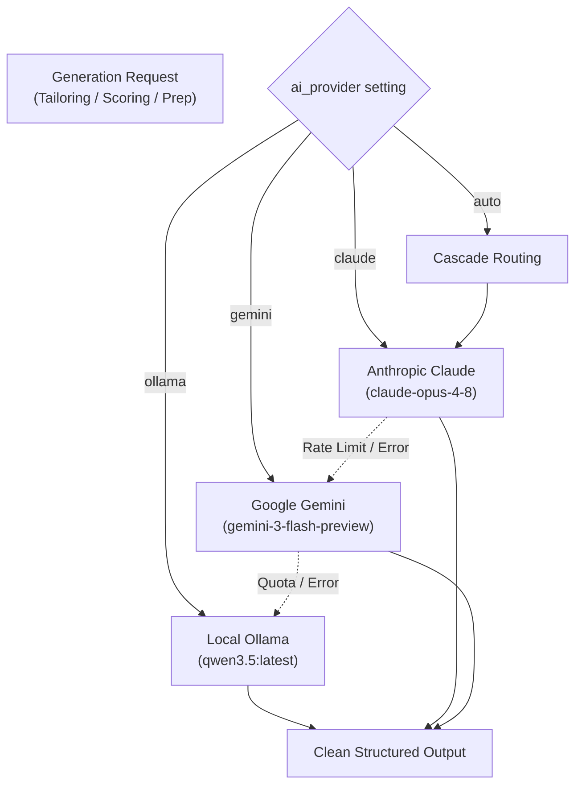

# JobBot API & Integration Specification

This guide outlines JobBot's multi-tier inference architecture, web scraping integrations, Windows SSL configuration, and diagnostic utilities.

---

## 1. Multi-Tier LLM Inference Architecture

JobBot provides a unified AI abstraction layer (`jobbot/ai_client.py`) supporting offline local LLMs and major cloud providers with automatic failover.



### Provider Configuration Table

| Provider | Setting Key | Environment Variable | Default Model | Primary Use Case |
|---|---|---|---|---|
| **Ollama** | `ollama_model` | `OLLAMA_MODEL` | `qwen3.5:latest` | Zero-cost, zero-leakage local generation |
| **Ollama Embeddings** | `ollama_embed_model` | `OLLAMA_EMBED_MODEL` | `nomic-embed-text` | Sub-millisecond semantic job matching |
| **Anthropic Claude** | `claude_model` | `CLAUDE_MODEL` | `claude-opus-4-8` | High-reasoning cover letters & styling |
| **Google Gemini** | `gemini_model` | `GEMINI_MODEL` | `gemini-3-flash-preview` | Fast high-throughput screening & grading |

### Fallback Cascade & Quota Resilience
- **Ollama Timeout Guard:** Configured via `OLLAMA_TIMEOUT=300` to prevent indefinite CPU hangs.
- **Gemini Fallback Chain:** Configured via `GEMINI_FALLBACK_CHAIN=gemini-2.5-flash,gemini-3.1-flash-lite-preview`. If the primary model encounters a `429 Too Many Requests`, JobBot automatically walks down the chain to lower-cost tiers before failing.
- **Fail-Open Strategy:** If cloud APIs fail, background scraping and local pipeline operations continue uninterrupted.

---

## 2. Scraping Backends & Board APIs

JobBot combines direct ATS API queries with unified search aggregators:

### 1. Direct ATS Ingestion
- **Greenhouse:** Leverages public JSON endpoints:
  `https://boards-api.greenhouse.io/v1/boards/{slug}/jobs`
- **Lever:** Leverages public board endpoints:
  `https://api.lever.co/v0/postings/{slug}?mode=json`
- **Ashby:** Leverages public posting API:
  `https://api.ashbyhq.com/posting-api/job-board/{slug}`
- **Workday:** Queries public tenant job boards (`wd1` through `wd5`) via direct paginated JSON requests. Targets are configured in `data/workday_targets.txt`.

### 2. Multi-Board Search (JobSpy)
Integrated via `python-jobspy` to query:
- LinkedIn
- Indeed
- Glassdoor
- ZipRecruiter
Controlled by keywords (`SEARCH_KEYWORDS`) and locations (`SEARCH_LOCATIONS`).

### 3. Google Custom Search (Contact Discovery)
To discover relevant hiring managers, recruiters, and alumni on LinkedIn without triggering anti-bot protections:
- Requires `GOOGLE_CSE_KEY` and `GOOGLE_CSE_CX`.
- Falls back to keyless DuckDuckGo (`ddgs`) when Google CSE is not configured.

---

## 3. Windows Native SSL Truststore Architecture

### The Windows SSL Challenge
Python on Windows historically relies on static Mozilla CA bundles distributed through `certifi`. Enterprise environments, corporate proxies, and specific CDNs (like LinkedIn or Workday) frequently fail verification with:
```
SSLCertVerificationError: [SSL: CERTIFICATE_VERIFY_FAILED]
```

### The JobBot Solution
JobBot initializes `truststore` at startup in `jobbot/__init__.py`:
```python
try:
    import truststore
    truststore.inject_into_ssl()
except Exception:
    pass
```
This forces all Python standard library SSL connections (`requests`, `urllib3`, etc.) to delegate directly to the **Windows Native Certificate Store (CryptoAPI / Schannel)**, ensuring automatic compliance with corporate root certificates and Windows system updates.

---

## 4. Diagnostics & Tooling

JobBot provides standalone diagnostic tools in `tools/`:

### Google Custom Search Diagnostic (`tools/cse_diag.py`)
Tests and validates your Google CSE key and search engine ID:
```bash
python tools/cse_diag.py
```
Outputs status codes, response previews, and identifies Google Cloud Project configuration mismatches.

---

## 5. ⚠️ Auto-Apply Subsystem API (Experimental Preview)

> [!WARNING]
> **Active Development Warning:** The automated application engine (`jobbot/browser_apply.py`, `jobbot/ats/*`) is in alpha. Automated submission is disabled by default (`auto_apply: false`, `browser_apply_autosubmit: false`).

### Execution Modes:
1. **Interactive Review (Default Recommended):**
   Runs a visible browser window (`playwright_headed: true`). Fields are filled automatically, and the engine pauses at the final review screen for human confirmation before any submission occurs.
2. **Headless Autosubmit (Experimental):**
   Intended for automated test harnesses only. Requires explicit opt-in via environment variables.

### Safety Checkpoints:
- **Honeypot Protection:** Honeypot and invisible inputs are filtered to avoid spam triggers.
- **CAPTCHA Pauses:** Recognized CAPTCHA signatures (`turnstile`, `hcaptcha`, `recaptcha`) trigger an immediate pause, notifying the user to intervene.
