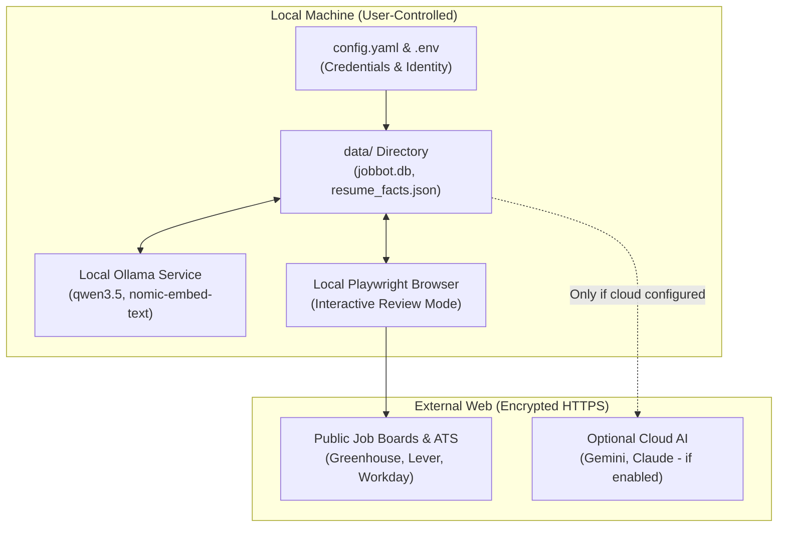

# Privacy & PII Architecture Guide

JobBot is designed from the ground up as a **privacy-first, local-first platform**. Because job searching inherently involves highly sensitive Personally Identifiable Information (PII) — full legal names, home addresses, phone numbers, work histories, compensation targets, and demographic self-identifications — JobBot implements strict architectural safeguards to prevent accidental leaks.

---

## 1. Zero-Leakage Guarantee

JobBot enforces a **Zero-Leakage Contract**:
1. **Local-First Boundary:** Your real candidate resume, database (`jobbot.db`), answer history, and credentials never leave your machine unless you explicitly choose to call an external cloud LLM.
2. **Offline-Default Inference:** By default, JobBot uses **local Ollama models** (`qwen3.5`, `nomic-embed-text`) running on your local CPU/GPU via `http://localhost:11434`. In this mode, **0 bytes of data ever leave your localhost**.
3. **Redaction & Sanitization Pipeline:** When diagnostic or application recon files are captured during browser interactions, all sensitive tokens (names, street addresses, phone numbers, personal emails) are automatically redacted before saving.

---

## 2. Threat Model & Definitions of PII in JobBot

In JobBot, data is classified into three categories:

| Data Category | Examples | Storage Location | Protection Mechanism |
|---|---|---|---|
| **Direct PII** | Full name, phone, email, home street address, postal code, LinkedIn/GitHub URLs | `data/resume_facts.json`, `data/My Information.txt`, `.env`, `config.yaml` | Strictly `.gitignore`d; local-only |
| **Sensitive Attributes** | EEO race/ethnicity, veteran status, disability disclosures, salary expectations | `data/answer_bank.json`, `data/answer_memory.json` | Strictly `.gitignore`d; masked in logs |
| **Account Credentials** | Workday tenant passwords, SMTP app passwords, API keys | `data/workday_accounts.json`, `.env` | Strictly `.gitignore`d; plaintext never committed |

---

## 3. Local-First Architecture



### Key Architectural Safeguards:
- **No Cloud Database:** There is no remote central database or analytics telemetry. SQLite stores all records locally at `data/jobbot.db`.
- **Zero Cloud Tracking:** No usage telemetry, analytics pings, or crash reporting services are embedded.
- **Fail-Open Isolation:** If any cloud provider errors out or is unconfigured, the system safely falls back to local deterministic checks or local Ollama.

---

## 4. Sanitization & Redaction Pipelines

JobBot includes an active sanitization engine (`jobbot/recon_sanitize.py`):

1. **Token Identification:** On startup, JobBot extracts all identity tokens from your configured profile (full name, first name, last name, phone formats, email, street address lines).
2. **DOM & Tree Redaction:** When DOM snapshots or debug trees are recorded during browser sessions (`recon/` directory):
   - All text leaves are checked against identity tokens.
   - Matched tokens are replaced with generic placeholders (`[REDACTED]`, `Jane Doe`, etc.).
   - Truncated prefixes/tails (e.g. partial phone numbers or addresses) are scrubbed.
3. **Logging Guard:** Passwords, API keys, and sensitive EEO question answers are masked in `logs/jobbot.log`.

---

## 5. Guide for Users: Keeping Your Data Safe

To prevent accidental data exposure:

### 1. Never Commit the `data/` Directory
The `data/` directory contains your actual database and profile facts. The root `.gitignore` is pre-configured to ignore all `.db`, `.json`, `.md`, and `.txt` files in `data/` while keeping example templates (`*.example.*`):
```bash
# Verify your git status before committing:
git status --ignored
```
Ensure that files like `data/jobbot.db`, `data/resume_facts.json`, or `.env` are listed under **Ignored files**, never untracked or staged.

### 2. Use Example Templates as Starting Points
Always duplicate `.example` files rather than editing them in place:
```bash
cp config.example.yaml config.yaml
cp .env.example .env
cp data/resume_facts.example.json data/resume_facts.json
cp data/companies.example.md data/companies.md
```

### 3. Running Fully Offline (Air-Gapped Tailoring)
To run with 100% offline privacy for resume tailoring and application kit generation:
1. Install [Ollama](https://ollama.com).
2. Pull the models:
   ```bash
   ollama pull qwen3.5:latest
   ollama pull nomic-embed-text:latest
   ```
3. Set `AI_PROVIDER=ollama` in your `.env` or `ai_provider: "ollama"` in `config.yaml`.
4. Leave cloud API keys (`GEMINI_API_KEY`, `ANTHROPIC_API_KEY`) blank.
