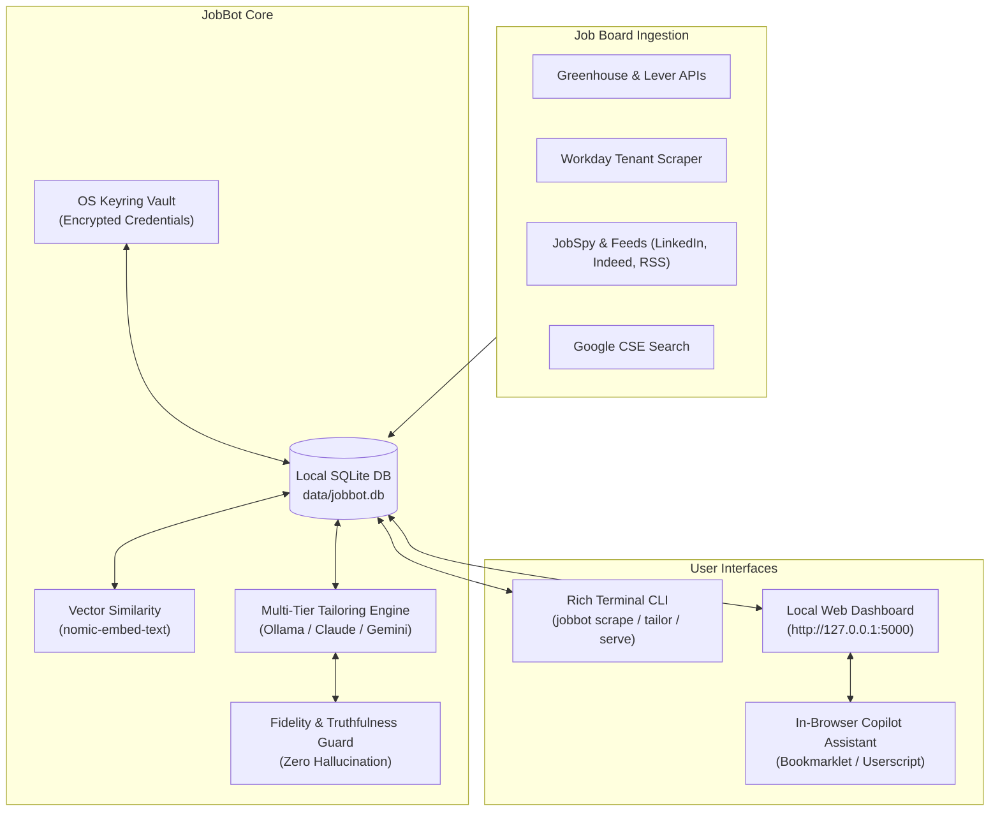

# JobBot

> **Privacy-first, autonomous career intelligence, tailoring engine, and in-browser application assistant.**  
> Aggregates job boards, ranks opportunities with semantic embeddings, generates truthful tailored resumes & cover letters (DOCX & PDF), and provides zero-captcha autofill via an in-browser copilot—powered by local offline LLMs.

[](https://www.python.org/downloads/)
[](LICENSE)
[](PII.md)
[]()

---

## Key Highlights & Capabilities

- 🔒 **Zero-PII & Local-First Privacy:** Runs with 100% offline local inference via [Ollama](https://ollama.com). Your resume, databases, and application history never leave your machine.
- 🎯 **Truthfulness & Anti-Hallucination Guard:** Strictly grounds tailoring on your real candidate records (`data/resume_facts.json`). Never fabricates credentials, employers, dates, or metrics.
- 📄 **SOTA Tailoring & Formatting:**
  - **Dual Export:** Exports executive-styled Word documents (`.docx`) and ATS-optimized PDFs.
  - **Adaptive Page Budgeting:** Automatically calculates vertical clearance to guarantee an exact 1-page or 2-page fit with zero awkward orphan lines.
  - **3-Tier ATS Breakdown:** Classifies requirements into Exact Keyword Matches, Conceptual Bridges, and Omitted Gaps.
  - **Bullet Polisher:** Replaces generic phrasing with strong, active technical verbs and authentic impact metrics while strictly banning AI buzzwords (*spearheaded*, *leveraged*, *streamlined*).
  - **Extensible Strategic Angles:** Modular presets (`data/strategic_angles.json`) to dynamically tilt focus toward engineering leadership, individual contributor depth, research, or rapid scaling.
- 🚀 **1-Click In-Browser Copilot (Zero-Captcha / Zero-Ban):**
  - Runs directly inside your authentic browser (Chrome, Edge, Firefox) via bookmarklet or Tampermonkey userscript.
  - 100% immune to Cloudflare Turnstile, Datadome, and Akamai CAPTCHAs.
  - **On-the-Fly AI Screening Q&A:** Dynamically answers novel screening questions grounded on your profile, snapping to dropdown and radio options automatically.
  - Visual color badges: emerald green (`#10b981`) for verified standard fields, purple (`#8b5cf6`) for dynamically AI-answered screening prompts.
- 🔐 **OS Keyring Security:** Credentials (such as Workday tenant logins) are encrypted in the native OS credential store (`keyring`), never hardcoded in plaintext.
- 🌐 **Multi-Board Aggregation:** Scrapes Greenhouse, Lever, Ashby, Workday, Indeed, LinkedIn, Google CSE, and RSS feeds with native Windows SSL truststore resilience (`truststore`).
- 📊 **Interactive Web Dashboard:** Fast zero-reload dashboard featuring a Kanban pipeline, resume diff inspector, interview prep coach, and networking contact tracker.

---

## Architecture Overview



---

## Quickstart Guide

### 1. Prerequisites
- Python 3.10 or newer
- [Ollama](https://ollama.com/) (recommended for free, private, offline inference)

### 2. Installation

Clone this repository and set up a virtual environment:

```bash
git clone https://github.com/your-username/job_bot.git
cd job_bot

# Create and activate virtual environment
python -m venv .venv
source .venv/bin/activate  # On Windows: .\.venv\Scripts\activate

# Install all production dependencies
pip install -r requirements.txt

# Or install as an editable package with development dependencies
pip install -e ".[dev]"
```

### 3. Setup Configuration

JobBot separates general configuration from private credentials:

```bash
# Copy template configurations
cp config.example.yaml config.yaml
cp .env.example .env

# Set up candidate profile templates in data/
cp data/resume_facts.example.json data/resume_facts.json
cp data/profile_context.example.py data/profile_context.py
cp data/strategic_angles.example.json data/strategic_angles.json
cp data/companies.example.md data/companies.md
cp data/ats_targets.example.txt data/ats_targets.txt
cp data/workday_targets.example.txt data/workday_targets.txt
```

Edit `data/resume_facts.json` and `data/profile_context.py` with your verified skills, employment history, and education.

### 4. Pull Local Offline Models (Recommended)

To run completely offline with zero API costs:

```bash
ollama pull qwen3.5:latest
ollama pull nomic-embed-text:latest
```

### 5. Launch the Web Dashboard

```bash
jobbot serve
```

Open your browser to [http://127.0.0.1:5000](http://127.0.0.1:5000) to view your jobs, search builder, and Kanban pipeline.

---

## In-Browser Copilot Assistant

JobBot Copilot bridges the gap between automation and your everyday browser session, eliminating headless bot detection, IP bans, and CAPTCHA stalls.

### Setup (Bookmarklet)
Create a new bookmark in Chrome, Edge, or Firefox and paste the following URL:

```javascript
javascript:(function(){const s=document.createElement('script');s.src='http://localhost:5000/static/jobbot_copilot.js?t='+Date.now();document.head.appendChild(s);})();
```

### Usage
1. Navigate to any job application page on Workday, Greenhouse, Lever, Ashby, or custom ATS portals.
2. Click your **JobBot Copilot** bookmark.
3. Use the floating toolbar to:
   - **Autofill Page:** Instantly maps your contact info, LinkedIn, GitHub, address, and tailored screening answers into form fields (highlighted in emerald green).
   - **AI Answer Remaining:** Uses `/api/copilot/answer-question` to evaluate novel screening questions in real time with local Ollama, grounded on your base facts (highlighted in purple).
   - **Review & Submit:** Highlights completed sections for human review before final submission.

For full setup details and userscript options, see the [Copilot Guide](tools/copilot/README.md).

---

## Common CLI Commands

| Command | Description |
|---|---|
| `jobbot scrape` | Run a full scrape cycle across all configured job boards |
| `jobbot serve` | Launch the local web dashboard and Kanban board (`:5000`) |
| `jobbot tailor <job_id>` | Tailor a resume and cover letter for a specific job |
| `jobbot contacts <job_id>` | Discover hiring managers and team leads for a target role |
| `jobbot status` | View database summary, scrape history, and pipeline counts |
| `jobbot apply <job_id>` | Prepare application package and open posting in browser for Copilot |

---

## Running Tests

Verify your installation with the complete test suite:

```bash
pytest
```

Run targeted subsystems:
```bash
pytest tests/test_copilot_package.py tests/test_sota_tailoring.py
pytest tests/test_workday_accounts.py tests/test_ui_smoke.py
```

---

## Documentation

- [PII & Privacy Architecture (PII.md)](PII.md): Data isolation, threat model, and zero-leakage guarantee.
- [API & Integration Specifications (API.md)](API.md): Model routing, scraper specs, and Windows SSL native truststore.
- [Agent & Contributor Rules (AGENTS.md)](AGENTS.md): Architectural invariants and development standards.
- [Copilot Guide (tools/copilot/README.md)](tools/copilot/README.md): In-Browser Copilot setup and API documentation.

---

## License

This project is licensed under the [MIT License](LICENSE).
